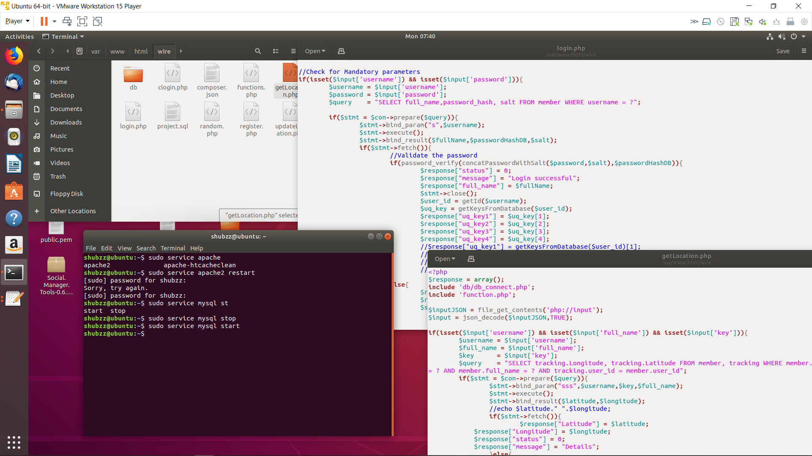

# Wire Back-end

Back-end Code to handle client request.

## Prerequisite

```bash
1. Should have apache or any other server installed
     ---> sudo apt-get install apache2

2. Should have MySQL or any other database installed
    ---> sudo apt install mysql-server 
```

## Installation


```bash
1. git clone https://github.com/Shubzz-02/Wire-backend.git

2. Create a mysql user.
    ---> CREATE USER 'project'@'localhost' IDENTIFIED BY 'password';

3. Create a database
   ---> CREATE DATABASE project;

4. Grant Permission to user.
   ---> GRANT ALL PRIVILEGES ON project.* TO 'project'@'localhost';

5. Import project.sql
   ---> mysql -u project -p project < project.sql

6. Copy this cloned repository to your www dir.

7. Start Apache and Mysql service
   ---> sudo service restart apache2
   ---> sudo service restart mysql

```

## ScreenShot



